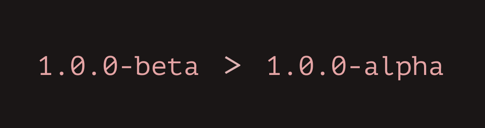

<br />
A semantic version comparison tool

## Install

```bash
pnpm install @renovator/version
```

## API

- [x] [API Documents](https://branlice.github.io/version/modules.html)

## Example

- [default example](./example/index.html)
- [custom prerelease version](./example/custom-prerelease.html)
- [custom prerelease validate](./example/custom-prerelease-validate.html)
- [complex](./example/complex.html)

## Principle

```typescript
const version = "1.0.0";

function *walk(version) {
 yeild '1';
 yeild '0';
 yeild '0';
}

const iterator = walk(version);
iterator.next();

```
